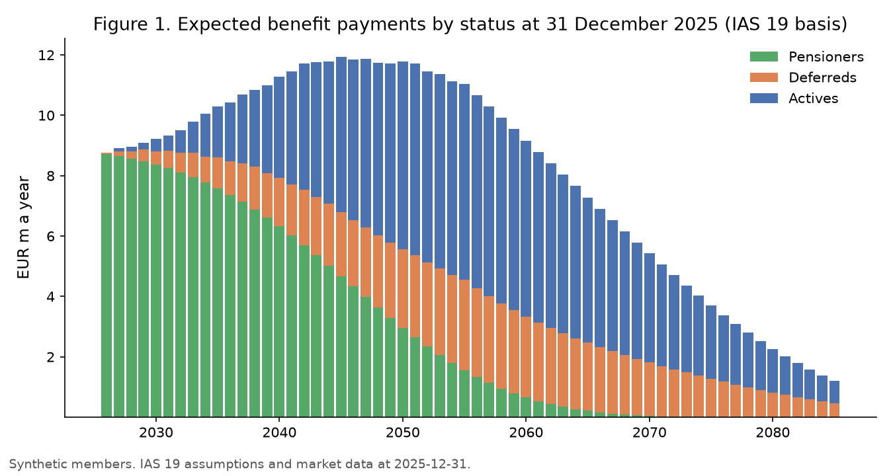
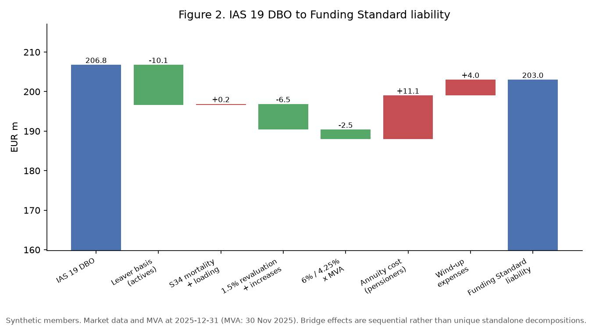
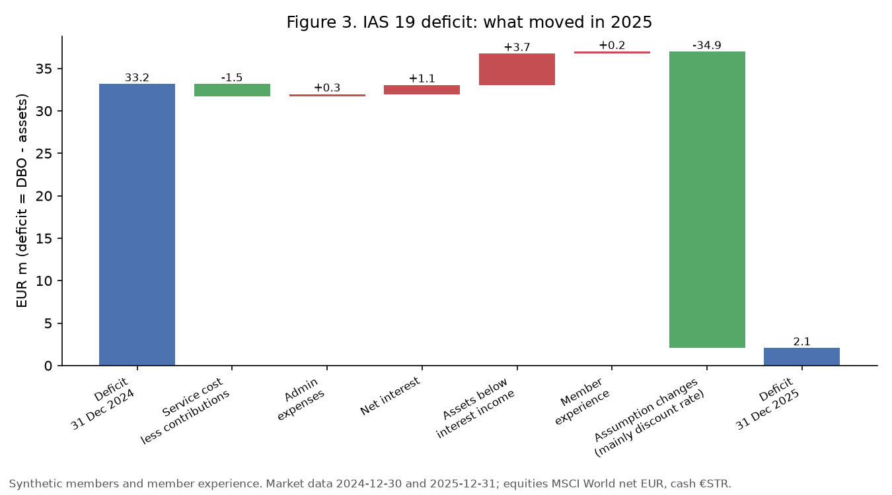
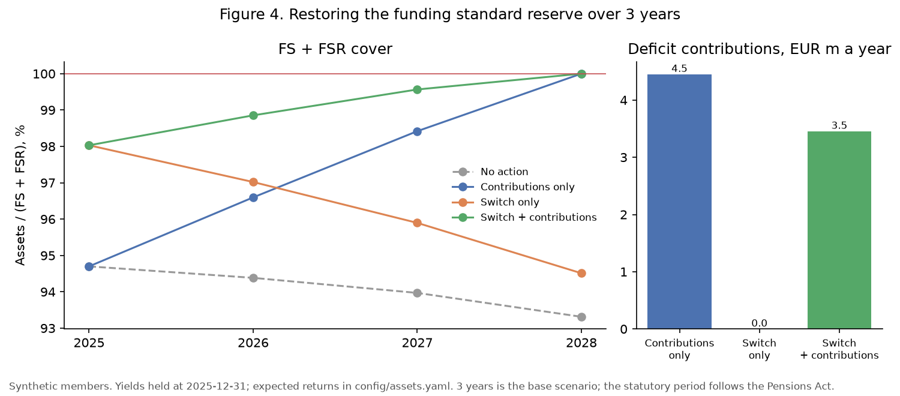
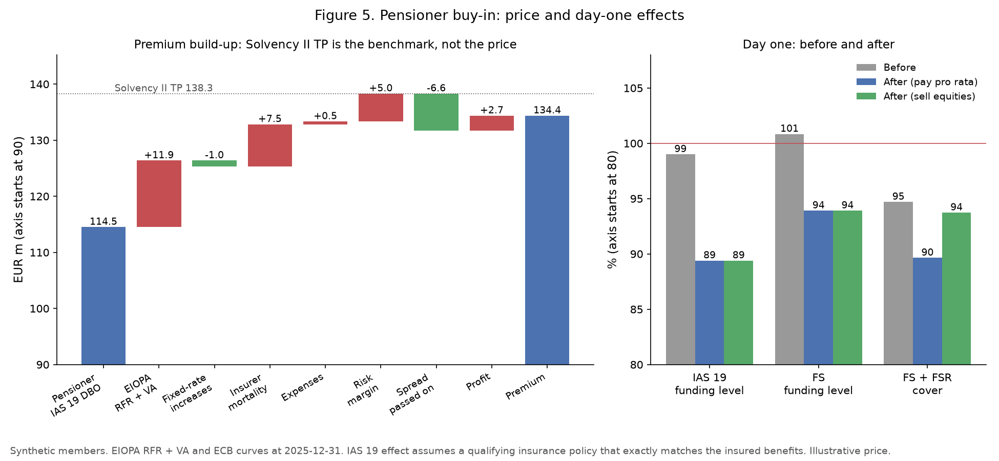

# DB Pension Scheme Model

A member-level model of a synthetic Irish final-salary scheme. It values the same benefits under **IAS 19** and under the **Irish Funding Standard** (with the funding standard reserve), explains the gap between them, rolls the scheme through 2025 on actual market data, measures risk, sizes a funding proposal and prices a pensioner buy-in: **two liability measures plus one transaction price**.

> All member data and member experience are synthetic. Market data are public and dated. Illustrative implementation based on published Pensions Authority and Society of Actuaries in Ireland guidance; not an actuarial certification or regulatory filing.

Project page: [pnlync.github.io/db-pension](https://pnlync.github.io/db-pension/) · Trustee memo: [`reports/trustee_memo.md`](reports/trustee_memo.md) · IAS 19 disclosure note: [`reports/disclosure_note.md`](reports/disclosure_note.md) · Build spec: [`SPEC.md`](SPEC.md)

## Business questions and answers (31 December 2025, EUR m)

| Question | Answer |
|---|---|
| What are the promises worth? | IAS 19 DBO 206.8 (actives 61.9, deferreds 30.4, pensioners 114.5); Funding Standard liability 203.0 |
| Why do the two differ? | Net gap 3.8: the statutory basis takes 18.8 off non-pensioners; annuity pricing adds 11.1 and wind-up costs 4.0 |
| What moved in 2025? | Yields rose: IAS 19 deficit 33.2 to 2.1; Funding Standard level 97.4% to 100.8% |
| How risky is it? | Hedge ratio 32% on IAS 19 but 67% on the Funding Standard |
| Contributions or investment? | FS + FSR shortfall 11.5: 4.5 a year for 3 years, or 3.5 with a 20% equity-to-sovereign switch |
| What would a pensioner buy-in cost? | 134.4, 117% of the pensioners' IAS 19 value; IAS 19 loss 19.9 under the qualifying exact-match assumption |

## Figures







## What is validated

- Section 34 market value adjustments reproduced for all 116 published months since January 2017.
- Three representative members recomputed in live Excel formulas ([`validation/excel_checks.xlsx`](validation/excel_checks.xlsx)) on the IAS 19, transfer-value and annuity bases, to the cent.
- IAS 19 to Funding Standard bridge and the 2025 analysis of change close with zero residual; asset and net-liability identities hold.
- Injected data errors all found; membership reconciliation differences zero.
- Assumptions calibrated to Irish 2025 annual reports; every assumption in [`data/assumptions_register.csv`](data/assumptions_register.csv).

## How to run

```bash
uv sync
uv run python -m pension.data_gen      # synthetic members (fixed seed)
uv run python -m pension.data_checks   # data checks and reconciliation
uv run python -m pension.pipeline      # all valuations, outputs/, reports/, docs/
uv run pytest
```

## Repository

```
config/      scheme rules, IAS 19, statutory (Section 34, ASP PEN-3, FSR), insurer and asset assumptions
data/        market data with sources (raw downloads not committed), synthetic members, assumptions register
src/pension/ engine, IAS 19, Funding Standard, bridge, analysis of change, risk, decisions, buy-in, pipeline
tests/       acceptance tests per module
validation/  Excel recomputation of three members
outputs/     every number and figure quoted anywhere
reports/     disclosure note, trustee memo
docs/        project page (GitHub Pages)
notes/       module notes (Chinese)
```
